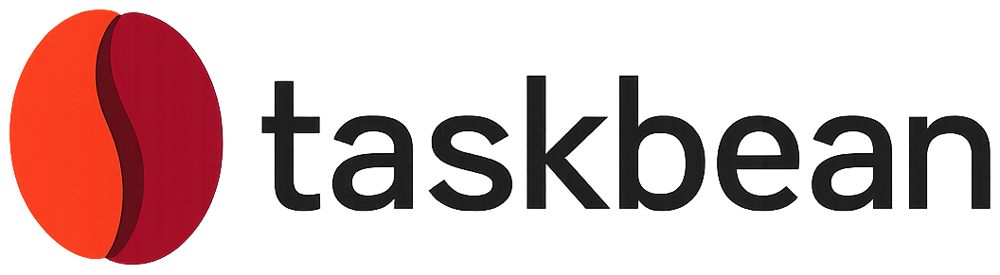
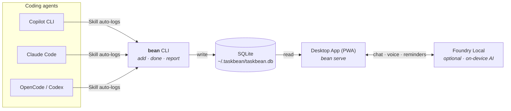

<div align="center">

<picture>
  <source media="(prefers-color-scheme: dark)" srcset="app/public/icons/taskbean-wordmark-light.png" />
  <source media="(prefers-color-scheme: light)" srcset="app/public/icons/taskbean-wordmark.png" />
  
</picture>

<br /><br />
**No cloud. No subscription. No data leaves your machine.**

[](https://taskbean.ai)
[](LICENSE)
[](https://www.microsoft.com/windows)
[](https://web.dev/progressive-web-apps/)
[](https://github.com/microsoft/foundry-local)

</div>

---

## What is taskbean?

taskbean is a **local-first task manager** built for developers who work with AI coding agents. It has two halves:

| | CLI (`cli/`) | Desktop App (`app/`) |
|---|---|---|
| **For** | AI agents (Copilot, Claude, etc.) | You, the developer |
| **Does** | Logs tasks as the agent works | Dashboard, AI chat, reminders, reports |
| **How** | `bean add "fix auth bug"` → `bean done` | PWA with Foundry Local on-device inference |
| **Tech** | Node.js, commander, SQLite | FastAPI + Express, Foundry Local SDK, vanilla JS PWA |

Both halves read and write the same local SQLite database at `~/.taskbean/taskbean.db`. The CLI is the **mechanism** — Copilot tracks your work automatically. The app is the **experience** — you see everything in a beautiful local dashboard.



## Quick Start

### CLI (Agent Skill)

```bash
# Install globally
npm install -g taskbean

# Or via platform binary
curl -fsSL https://taskbean.ai/install | bash          # macOS / Linux
iwr -useb https://taskbean.ai/install.ps1 | iex        # Windows PowerShell

# Use it
bean add "fix auth bug before standup"
bean done 1
bean list
bean report
```

### Desktop App

```bash
cd app

# Python backend (primary)
pip install -r agent/requirements.txt
python agent/main.py

# Or Node.js backend (legacy)
npm install
npm start

# Open http://localhost:2326
```

## Project Structure

```
taskbean/
├── cli/                    # Agent-facing CLI tool
│   ├── bin/taskbean.js     # Entry point (aliased as `bean`)
│   ├── src/commands/       # 16 commands: add, done, start, list, report...
│   ├── src/data/           # SQLite store, date parsing, project detection
│   ├── pwa/                # Minimal dashboard for `bean serve`
│   ├── scripts/            # Install scripts (curl|bash, PowerShell)
│   ├── evals/              # Agent skill evaluation scenarios
│   └── package.json        # npm: "taskbean"
│
├── app/                    # Human-facing desktop PWA
│   ├── agent/              # Python backend (FastAPI + Foundry Local)
│   ├── public/             # Single-file vanilla JS PWA
│   ├── tests/              # Playwright test suite (21 specs)
│   ├── server.js           # Node.js backend (Express, legacy)
│   ├── db.js               # SQLite schema + CRUD
│   └── package.json        # "taskbean-app" (not published to npm)
│
├── .agents/skills/taskbean/SKILL.md   # Agent skill manifest
├── .github/
│   ├── copilot-instructions.md
│   └── workflows/release.yml
├── LICENSE
└── README.md               # ← you are here
```

## Works With

taskbean ships as an [Agent Skill](https://agentskills.io). Install the skill, and your coding agent auto-discovers it — calling `bean add` / `bean done` as it works.

```bash
bean install              # install for all agents in current project
bean install --global     # install for all agents across all projects
bean install --agent claude   # install for a specific agent only
```

| Agent | Skill Discovery | Status | Notes |
|-------|----------------|--------|-------|
| **GitHub Copilot CLI** | `.agents/skills/` | ✅ Verified | Full E2E: discovers skill, calls `bean add`/`bean done` |
| **OpenCode** | `.agents/skills/` | ✅ Verified | Full E2E: discovers skill, calls `bean add`/`bean done` |
| **OpenAI Codex** | `.agents/skills/` | ⚠️ Discovery works | Reads SKILL.md, calls `bean add` — but sandbox blocks DB writes. Add `~/.taskbean` to sandbox permissions |
| **Claude Code** | `.claude/skills/` | ✅ Verified | Needs `.claude/skills/` (does not scan `.agents/skills/`). `bean install` handles this |
| **Any Agent Skills-compatible agent** | `.agents/skills/` | ✅ Expected | Follows the [Agent Skills spec](https://agentskills.io) |

## How It Works

The CLI ships as a [Copilot Agent Skill](https://agentskills.io). When installed, AI agents auto-discover taskbean and call `bean add` / `bean done` as they work — no prompting required.

The desktop app runs entirely on your device using [Microsoft Foundry Local](https://github.com/microsoft/foundry-local) for AI inference (NPU, GPU, or CPU). Features include:

- 💬 Natural language task management
- ⏰ Smart reminders with Windows notifications
- 🔄 Recurring tasks
- 🧠 Multi-model support (Phi-4, Qwen, etc.)
- 🎤 Voice input
- 📎 File extraction (meeting notes → tasks)
- 🎨 4 themes (Dark, Light, Java Cream, High Contrast)
- 🤓 Nerd mode with live telemetry
- 📊 Multi-agent usage tracking — detects Copilot CLI, Claude Code, Codex, and OpenCode sessions on disk and attributes each task to the agent that created it. Only metadata and aggregate token counts are stored; message bodies never leave the agent's own logs. Toggle per-agent from **Settings → Agents**.

## Storage

All data stays local in a single SQLite database:

```
~/.taskbean/taskbean.db
```

Both the CLI and the desktop app read and write to this file. No cloud sync, no accounts, no telemetry.

## License

[MIT](LICENSE) — free forever.
