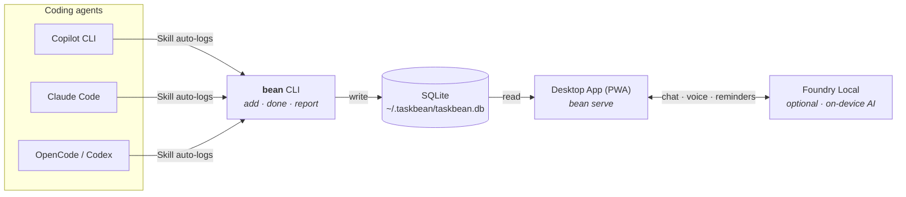

<div align="center">

<picture>
  <source media="(prefers-color-scheme: dark)" srcset="app/public/icons/taskbean-wordmark-light.png" />
  <source media="(prefers-color-scheme: light)" srcset="app/public/icons/taskbean-wordmark.png" />
  
</picture>

<br /><br />
**No cloud. No subscription. No data leaves your machine.**

[](https://taskbean.ai)
[](LICENSE)
[](https://www.microsoft.com/windows)
[](https://web.dev/progressive-web-apps/)
[](https://github.com/microsoft/foundry-local)

</div>

---

## What is taskbean?

taskbean is a **local-first task manager** built for developers who work with AI coding agents. It has two halves:

| | CLI (`cli/`) | Desktop App (`app/`) |
|---|---|---|
| **For** | AI agents (Copilot, Claude, etc.) | You, the developer |
| **Does** | Logs tasks as the agent works | Dashboard, AI chat, reminders, reports |
| **How** | `bean add "fix auth bug"` → `bean done` | PWA with Foundry Local on-device inference |
| **Tech** | Node.js, commander, SQLite | FastAPI + Express, Foundry Local SDK, vanilla JS PWA |

Both halves read and write the same local SQLite database at `~/.taskbean/taskbean.db`. The CLI is the **mechanism** — Copilot tracks your work automatically. The app is the **experience** — you see everything in a beautiful local dashboard.



## Quick Start

### CLI (Agent Skill)

```bash
# Install globally
npm install -g taskbean

# Or via platform binary
curl -fsSL https://taskbean.ai/install | bash          # macOS / Linux
iwr -useb https://taskbean.ai/install.ps1 | iex        # Windows PowerShell

# Use it
bean add "fix auth bug before standup"
bean done 1
bean list
bean report
```

### Desktop App

```bash
cd app

# Python backend (primary)
pip install -r agent/requirements.txt
python agent/main.py

# Or Node.js backend (legacy)
npm install
npm start

# Open http://localhost:2326
```

## Project Structure

```
taskbean/
├── cli/                    # Agent-facing CLI tool
│   ├── bin/taskbean.js     # Entry point (aliased as `bean`)
│   ├── src/commands/       # 16 commands: add, done, start, list, report...
│   ├── src/data/           # SQLite store, date parsing, project detection
│   ├── pwa/                # Minimal dashboard for `bean serve`
│   ├── scripts/            # Install scripts (curl|bash, PowerShell)
│   ├── evals/              # Agent skill evaluation scenarios
│   └── package.json        # npm: "taskbean"
│
├── app/                    # Human-facing desktop PWA
│   ├── agent/              # Python backend (FastAPI + Foundry Local)
│   ├── public/             # Single-file vanilla JS PWA
│   ├── tests/              # Playwright test suite (21 specs)
│   ├── server.js           # Node.js backend (Express, legacy)
│   ├── db.js               # SQLite schema + CRUD
│   └── package.json        # "taskbean-app" (not published to npm)
│
├── .agents/skills/taskbean/SKILL.md   # Agent skill manifest
├── .github/
│   ├── copilot-instructions.md
│   └── workflows/release.yml
├── LICENSE
└── README.md               # ← you are here
```

## Works With

taskbean ships as an [Agent Skill](https://agentskills.io). Install the skill, and your coding agent auto-discovers it — calling `bean add` / `bean done` as it works.

```bash
bean install              # install to .agents/skills/ (discovered by Copilot CLI, OpenCode, Codex)
bean install --global     # same, but into ~/ so every project sees it
bean install --agent claude                  # also install to .claude/skills/ (Claude Code)
bean install --agent codex --codex-sandbox   # Codex + whitelist ~/.taskbean in ~/.codex/config.toml
bean install --agent all                     # .agents/skills/ + .github/skills/ + .claude/skills/
```

| Agent | Skill Discovery | Status | Notes |
|-------|----------------|--------|-------|
| **GitHub Copilot CLI** | `.agents/skills/` | ✅ Verified | Full E2E: discovers skill, calls `bean add`/`bean done` |
| **OpenCode** | `.agents/skills/` | ✅ Verified | Full E2E: discovers skill, calls `bean add`/`bean done` |
| **OpenAI Codex** | `.agents/skills/` | ✅ Verified | Full E2E: discovers skill, calls `bean add`/`bean done`. Codex's sandbox may block direct edits to project source; use `bean install --agent codex --codex-sandbox` to also whitelist `~/.taskbean` in `~/.codex/config.toml` |
| **Claude Code** | `.claude/skills/` | ✅ Verified | Needs `.claude/skills/` (does not scan `.agents/skills/`). `bean install` handles this |
| **Any Agent Skills-compatible agent** | `.agents/skills/` | ✅ Expected | Follows the [Agent Skills spec](https://agentskills.io) |

## How It Works

### The CLI — an agent skill

taskbean ships as an [Agent Skill](https://agentskills.io) that Copilot CLI, Claude Code, Codex, and OpenCode auto-discover. While an agent works, it calls `bean add` to log tasks and `bean done` to close them — no prompting from you required. 17 commands cover the full lifecycle: `add`, `start`, `done`, `list`, `edit`, `remove`, `remind`, `block`, `track`, `projects`, `report`, `export`, `serve`, and more. Every write goes straight to `~/.taskbean/taskbean.db`.

### The desktop app — local AI on your device

The app is a single-page PWA served by a Python FastAPI backend (`agent/main.py`). All AI inference runs locally via [Microsoft Foundry Local](https://github.com/microsoft/foundry-local), which picks the best execution provider on your machine — NPU (VitisAI), GPU (MIGraphX/CUDA), or CPU — and loads models like Phi-4, Qwen, or Llama entirely on-device.

Chat uses the [AG-UI protocol](https://github.com/ag-ui-protocol/ag-ui) over Server-Sent Events. Your message streams into the agent, the agent calls tools (`add_task`, `set_reminder`, `complete_task`, etc.), and state deltas stream back to the UI — so you see tasks appear as the model decides to create them.

Features:

- 💬 Natural language task management with multi-turn tool calling
- ⏰ Smart reminders with native Windows toast notifications
- 🔄 Recurring task templates
- 🧠 In-app model switching (Phi-4, Qwen, Llama — any Foundry Local catalog model)
- 🎤 Voice input
- 📎 File extraction — paste meeting notes or drop documents; MCP + MarkItDown converts and chunks them into tasks
- 🎨 4 coffee-themed palettes — Dark Roast, Latte, Espresso, Black Coffee
- 🤓 **Nerd panel** — live OpenTelemetry trace stream with 4 tabs (Events, Metrics, Traces, Logs), plus a bundled [Jaeger v2](http://localhost:16686) UI for waterfall inspection
- 📊 **Multi-agent usage tracking** — scans Copilot CLI, Claude Code, Codex, and OpenCode session logs on disk and attributes each task to the agent/session that created it. Only metadata and aggregate token counts are stored; prompts, tool outputs, and code blocks never leave the agent's own logs. Toggle per-agent from **Settings → Agents**.

### The shared database

The CLI and the app both point at `~/.taskbean/taskbean.db`. The CLI owns task writes; the Python backend owns agent-usage writes (`agent_sessions`, `agent_turns`, `agent_sources`). A scanner in the backend tails each agent's local log files forward-only (crash-safe, rotation-aware) and backfills `todos.agent` / `todos.agent_session_id` so every task has a traceable source.

## Storage

All data stays local in a single SQLite database:

```
~/.taskbean/taskbean.db
```

Both the CLI and the desktop app read and write to this file. No cloud sync, no accounts, no telemetry.

## License

[MIT](LICENSE) — free forever.
