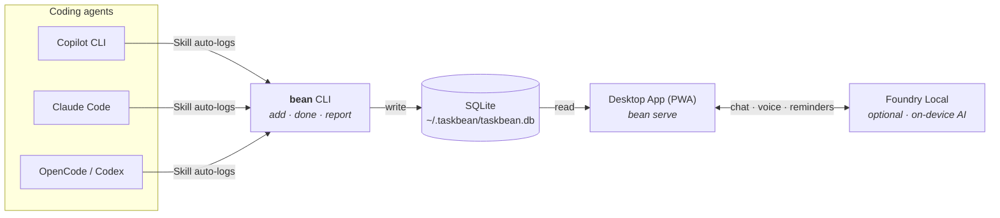

<div align="center">

<picture>
  <source media="(prefers-color-scheme: dark)" srcset="app/public/icons/taskbean-wordmark-light.png" />
  <source media="(prefers-color-scheme: light)" srcset="app/public/icons/taskbean-wordmark.png" />
  
</picture>

<br /><br />
**No cloud. No subscription. No data leaves your machine.**

[](https://taskbean.ai)
[](LICENSE)
[](https://www.microsoft.com/windows)
[](https://web.dev/progressive-web-apps/)
[](https://github.com/microsoft/foundry-local)

</div>

---

## What is taskbean?

A local-first task manager for developers whose day job involves a coding agent. Two halves, one SQLite file:

| | CLI (`cli/`) | Desktop app (`app/`) |
|---|---|---|
| **For** | The agent (Copilot, Claude, Codex, OpenCode) | You |
| **Does** | Logs tasks as the agent works | Dashboard, chat, reminders, reports |
| **How** | `bean add "fix auth bug"` → `bean done` | PWA with Foundry Local on-device inference |
| **Tech** | Node.js, commander, SQLite | FastAPI + Express, Foundry Local SDK, vanilla JS PWA |

Both halves read and write `~/.taskbean/taskbean.db`. The agent does the typing; you do the reviewing. Nothing leaves the machine.



## Quick start

### CLI (agent skill)

```bash
# Install globally
npm install -g taskbean

# Or via platform binary
curl -fsSL https://taskbean.ai/install | bash          # macOS / Linux
iwr -useb https://taskbean.ai/install.ps1 | iex        # Windows PowerShell

# Use it
bean add "fix auth bug before standup"
bean done 1
bean list
bean report
```

### Desktop app

```bash
cd app

# Python backend (primary)
pip install -r agent/requirements.txt
python agent/main.py

# Or Node.js backend (legacy)
npm install
npm start

# Open http://localhost:2326
```

## Project structure

```
taskbean/
├── cli/                    # Agent-facing CLI tool
│   ├── bin/taskbean.js     # Entry point (aliased as `bean`)
│   ├── src/commands/       # 16 commands: add, done, start, list, report...
│   ├── src/data/           # SQLite store, date parsing, project detection
│   ├── pwa/                # Minimal dashboard for `bean serve`
│   ├── scripts/            # Install scripts (curl|bash, PowerShell)
│   ├── evals/              # Agent skill evaluation scenarios
│   └── package.json        # npm: "taskbean"
│
├── app/                    # Human-facing desktop PWA
│   ├── agent/              # Python backend (FastAPI + Foundry Local)
│   ├── public/             # Single-file vanilla JS PWA
│   ├── tests/              # Playwright test suite (21 specs)
│   ├── server.js           # Node.js backend (Express, legacy)
│   ├── db.js               # SQLite schema + CRUD
│   └── package.json        # "taskbean-app" (not published to npm)
│
├── .agents/skills/taskbean/SKILL.md   # Agent skill manifest
├── .github/
│   ├── copilot-instructions.md
│   └── workflows/release.yml
├── LICENSE
└── README.md               # ← you are here
```

## Works with

taskbean ships as an [Agent Skill](https://agentskills.io). Drop it in the right folder and the agent picks it up on its next run. `bean install` handles the folder.

```bash
bean install              # .agents/skills/  (Copilot CLI, OpenCode, Codex)
bean install --global     # same, but in ~/  so every project sees it
bean install --agent claude                  # .claude/skills/  (Claude Code needs its own folder)
bean install --agent codex --codex-sandbox   # also whitelists ~/.taskbean in ~/.codex/config.toml
bean install --agent all                     # install everywhere
```

| Agent | Skill Discovery | Status | Notes |
|-------|----------------|--------|-------|
| **GitHub Copilot CLI** | `.agents/skills/` | ✅ Verified | Full E2E: discovers skill, calls `bean add`/`bean done` |
| **OpenCode** | `.agents/skills/` | ✅ Verified | Full E2E: discovers skill, calls `bean add`/`bean done` |
| **OpenAI Codex** | `.agents/skills/` | ✅ Verified | Full E2E: discovers skill, calls `bean add`/`bean done`. Codex's sandbox may block direct edits to project source; use `bean install --agent codex --codex-sandbox` to also whitelist `~/.taskbean` in `~/.codex/config.toml` |
| **Claude Code** | `.claude/skills/` | ✅ Verified | Needs `.claude/skills/` (does not scan `.agents/skills/`). `bean install` handles this |
| **Any Agent Skills-compatible agent** | `.agents/skills/` | ✅ Expected | Follows the [Agent Skills spec](https://agentskills.io) |

## How it works

### The CLI is the robot

17 commands (`add`, `start`, `done`, `list`, `edit`, `remove`, `remind`, `block`, `track`, `projects`, `report`, `export`, `serve`, and a few more). The agent picks up the skill, notices a task is underway, and calls `bean add`. It closes with `bean done`. You never type any of this. You open the dashboard at the end of the day and there it is: a receipt of what got built.

### The app is the human side

A single-page PWA behind a FastAPI backend (`agent/main.py`). All inference is on-device through [Microsoft Foundry Local](https://github.com/microsoft/foundry-local), which auto-routes to the best silicon on the box: NPU via VitisAI, GPU via MIGraphX or CUDA, CPU as a fallback. Pick a model (Phi-4, Qwen, Llama, anything in the Foundry Local catalog) and switch between them from the settings panel.

Chat rides the [AG-UI protocol](https://github.com/ag-ui-protocol/ag-ui) over SSE. Tools like `add_task`, `set_reminder`, and `complete_task` run on the backend while state deltas stream back to the UI, so you watch tasks appear as the model invents them.

What's in the box:

- Natural-language task management with multi-turn tool calling 💬
- Reminders that fire real Windows toasts ⏰
- Recurring task templates 🔄
- In-app model switching across the Foundry Local catalog 🧠
- Voice input 🎤
- Paste a meeting transcript or drop a PDF; MCP + MarkItDown chew it into tasks 📎
- Four coffee-themed palettes: Dark Roast, Latte, Espresso, Black Coffee ☕
- A nerd panel with live OpenTelemetry traces (Events, Metrics, Traces, Logs tabs) plus a bundled [Jaeger v2](http://localhost:16686) waterfall 🤓
- Multi-agent usage tracking that watches Copilot CLI, Claude Code, Codex, and OpenCode session files on disk and attributes each task to the session that spawned it 📊

On that last one: only metadata and aggregate token counts are stored. Prompts, tool outputs, and code blocks stay in the agent's own logs where you left them. Toggle agents on and off under **Settings → Agents**.

### How the two halves stay honest

Same SQLite file, different lanes. The CLI writes `todos`. The Python backend writes `agent_sessions`, `agent_turns`, and `agent_sources` by tailing each agent's log files forward-only, with rotation detection so a crashed scan never double-counts. When a new session appears within 30 minutes of a fresh task in the same cwd, it backfills `todos.agent_session_id` so every todo can be traced back to the run that created it.

## Storage

Everything lives in one file:

```
~/.taskbean/taskbean.db
```

No cloud sync, no accounts, no phone-home telemetry. Delete the file, taskbean forgets.

## License

[MIT](LICENSE). Free forever.
