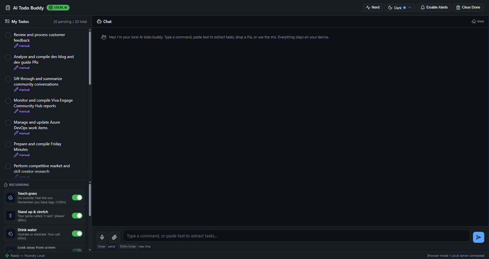

<div align="center">

# ☕ taskbean

**The no-nonsense AI task manager that lives on your machine and minds your business.**

No cloud. No subscription. No data leaves your machine — unless you want it to.
The grind is real. Keep it local.

[](LICENSE)
[](https://www.microsoft.com/windows)
[](https://web.dev/progressive-web-apps/)
[](https://github.com/microsoft/foundry-local)



</div>

---

## Why taskbean?

Every productivity app wants your data on their servers. Every AI assistant needs an API key and a monthly bill. The bean disagrees.

**taskbean** is a fully local, AI-native task manager. Your todos, your reminders, your conversations with the AI — all of it stays on your machine. The AI runs directly on your hardware (NPU, GPU, or CPU) through [Microsoft Foundry Local](https://github.com/microsoft/foundry-local). No internet required. No accounts. No telemetry phoning home.

> *What Obsidian did for notes, taskbean does for tasks — local-first, AI-native, and built for how developers actually work.*

- 🔒 **Private by default** — zero data leaves your device
- 🌐 **Connected by choice** — sync only when you say so, however you want
- 💸 **Free forever** — no API keys, no subscriptions, no usage limits
- ⚡ **Hardware-accelerated** — runs on NPU, GPU, or CPU via Foundry Local
- 📴 **Works offline** — installable as a PWA with full offline support
- 🛠️ **Developer-native** — CLI tool, agent skill, and cross-repo task visibility built in
- 🔓 **Open source** — MIT licensed, inspect every line

---

## What It Does

| Feature | Description |
|---------|-------------|
| 💬 **AI Chat** | Natural language task management — *"add a task to review PRs by Friday"* |
| ⏰ **Smart Reminders** | Set reminders with Windows notifications, snooze, and overdue alerts |
| 🔄 **Recurring Tasks** | Scheduled reminders like *"drink water every 45 minutes"* |
| 🧠 **Multi-Model** | Switch between Phi-4, Qwen, and other models on the fly |
| 🎤 **Voice Input** | Speech-to-text for hands-free task creation |
| 📎 **File Extraction** | Drop or paste files — AI extracts tasks from meeting notes, emails, docs |
| 🎨 **4 Themes** | Dark, Light, Java Cream, and High Contrast |
| 🤓 **Nerd Mode** | Live telemetry panel showing CPU, RAM, GPU, NPU, model stats, and OpenTelemetry traces |
| 🔗 **Agentic Protocol** | Built on [AG-UI](https://github.com/ag-ui-protocol/ag-ui) for real-time streaming agent responses |

---

## How It's Made

```
┌──────────────────────────────────────────────────────────────────┐
│  Browser (PWA)                                                   │
│  public/index.html — single-file vanilla JS SPA, no build step  │
└───────────────┬──────────────────────────────────────────────────┘
                │ AG-UI SSE (Server-Sent Events)
                ▼
┌──────────────────────────────────────────────────────────────────┐
│  Python Backend (FastAPI + Agent Framework)                      │
│  agent/main.py → agent.py → tools.py → state.py                 │
└───────────────┬──────────────────────────────────────────────────┘
                │ Foundry Local SDK (FFI)
                ▼
┌──────────────────────────────────────────────────────────────────┐
│  On-Device AI (Foundry Local)                                    │
│  NPU / GPU / CPU inference — Phi-4, Qwen, etc.                  │
└──────────────────────────────────────────────────────────────────┘
```

### Technology Stack

| Layer | Technology |
|-------|-----------|
| **Frontend** | Vanilla JS, CSS custom properties, Lucide icons — no bundler, no framework |
| **Backend** | Python 3.10+, FastAPI, uvicorn, Agent Framework + AG-UI protocol |
| **AI Runtime** | [Foundry Local SDK](https://github.com/microsoft/foundry-local) — on-device inference |
| **Telemetry** | OpenTelemetry → Jaeger (optional, for nerd mode tracing) |
| **Notifications** | Windows toast notifications via win10toast |
| **File Parsing** | MCP (Model Context Protocol) + MarkItDown |
| **Legacy Backend** | Node.js / Express 5 (still functional, in `server.js`) |

---

## Install

Choose the method that works best for you:

### Option 1: CLI (Developers)

```bash
# Clone the repo
git clone https://github.com/nicholasdbrady/taskbean.git
cd taskbean

# Launch (installs prerequisites, registers protocol handler, starts server)
./launch.cmd
```

Or step-by-step:

```bash
# Install Foundry Local
winget install Microsoft.FoundryLocal

# Install Python dependencies
cd agent
pip install -r requirements.txt

# Launch
python main.py
```

Open [http://localhost:2326](http://localhost:2326) in your browser.

### Option 2: One-Click Launch

After cloning, double-click **`launch.cmd`** (or run `launch.ps1` in PowerShell). It starts the server and opens the app in your default browser.

### Option 3: GitHub Release

1. Download the latest release from [Releases](../../releases)
2. Extract the zip
3. Double-click `launch.cmd`

### Option 4: Microsoft Store

> 🚧 **Coming soon** — taskbean will be available in the Microsoft Store as a PWA.

### Option 5: Install as PWA

1. Open [http://localhost:2326](http://localhost:2326) in Edge or Chrome
2. Click the install icon (⊕) in the address bar
3. The app installs as a standalone window with offline support

> **Tip:** Enable "Run on Windows startup" in Settings ⚙ so the server starts automatically.

---

## Rise & Grind

```bash
# 1. Clone and launch (handles everything)
git clone https://github.com/nicholasdbrady/taskbean.git
cd taskbean
./launch.cmd

# Or manually:
# 1. Make sure Foundry Local is installed
winget install Microsoft.FoundryLocal

# 2. Start the app
cd taskbean/agent
pip install -r requirements.txt
python main.py

# 3. Open in browser
# → http://localhost:2326
```

**First launch:** The app will download and load a default model (Phi-4 Mini). This takes a few minutes the first time. The status bar at the bottom shows progress.

**Try these:**
- `"Add a task to buy groceries"`
- `"Remind me to stretch in 30 minutes"`
- `"Plan my day"` — AI prioritizes your tasks
- Paste meeting notes → AI extracts action items
- Drop a PDF → AI pulls out tasks

---

## Dependencies

### Required

| Dependency | Version | Install |
|-----------|---------|---------|
| **Windows** | 10 or 11 | — |
| **Python** | 3.10+ | [python.org](https://www.python.org/downloads/) |
| **Foundry Local** | Latest | `winget install Microsoft.FoundryLocal` |

### Optional

| Dependency | Purpose | Install |
|-----------|---------|---------|
| **Docker** | Jaeger tracing (nerd mode) | [docker.com](https://www.docker.com/products/docker-desktop/) |
| **Node.js 18+** | Legacy Node backend only | [nodejs.org](https://nodejs.org/) |

### Python Packages (installed via `pip install -r requirements.txt`)

- `agent-framework` + `agent-framework-ag-ui` — Agent orchestration + AG-UI SSE protocol
- `foundry-local-sdk-winml` — Foundry Local on-device inference
- `fastapi` + `uvicorn` — Web framework
- `tiktoken` — Token counting for context management
- `opentelemetry-sdk` — Telemetry and tracing
- `win10toast` — Windows notifications
- `mcp` — MarkItDown file conversion

---

## Configuration

Access settings via the ⚙ gear icon in the app:

| Setting | Description |
|---------|-------------|
| **Model** | Switch between installed models (Phi-4, Qwen, etc.) |
| **Timezone** | Used for reminders and time-aware commands |
| **Theme** | Dark, Light, Java Cream, High Contrast |
| **Run on startup** | Register as a Windows startup app |
| **Notifications** | Enable/disable Windows toast notifications |

Settings are persisted to `~/.taskbean/config.json`.

---

## Troubleshooting

### "Server not running" overlay when opening the PWA

The app needs the local Python server running. Double-click `launch.cmd` in the app folder, or start manually:

```bash
cd agent && python main.py
```

`launch.cmd` also registers the `taskbean://` protocol handler so the PWA's "Start Server" button can restart the server automatically in the future.

### Model loading fails

```bash
# Check Foundry Local is installed and running
foundry model list

# Download a model manually
foundry model download phi-4-mini-instruct
```

### NPU not detected

NPU acceleration requires compatible hardware (e.g., Intel Core Ultra, Qualcomm Snapdragon X). taskbean gracefully falls back to GPU → CPU if NPU isn't available. Check your hardware in nerd mode (click the **✨ Nerd** button).

### Port 2326 already in use

Another process is using Port 2326. Find and stop it:

```powershell
Get-NetTCPConnection -LocalPort 2326 | Select-Object OwningProcess
Stop-Process -Id <PID>
```

### Jaeger/tracing not working

Jaeger is optional and runs via Docker. Start it manually:

```bash
docker compose up -d
```

The Jaeger UI is at [http://localhost:16686](http://localhost:16686). If Docker isn't installed, the app works fine without tracing — nerd mode still shows live metrics from the in-process ring buffer.

### Voice input not working

Local speech recognition requires a Windows language pack. If prompted, go to:

**Settings → Time & Language → Language & region → Add a language → English (United States) → Language pack & Speech recognition**

---

## Known Issues

- **Tool parity**: The Python backend has 7 tools; the legacy Node.js backend has 8 (`create_recurring_reminder` is Node-only)
- **Windows-only NPU**: NPU acceleration requires Windows. GPU/CPU work cross-platform with Foundry Local, but notifications and some hardware detection are Windows-specific
- **Single-user**: The app stores state in-memory (Python) or on-disk (Node). No multi-user support
- **Model size**: First model download can be 2–4 GB depending on the model

---

## Roadmap

The bean has plans.

- [ ] **`taskbean` CLI** — surface tasks and todos across local development repos from your terminal
- [ ] **Agent skill** — expose taskbean as a callable skill for AI coding agents and Foundry workflows
- [ ] **Browser extension** — highlight anything on the web, get AI-suggested tasks and read-later reminders with source links preserved
- [ ] **Clipboard capture** — auto-suggest task or reminder adds from clipboard content
- [ ] **Sync (opt-in)** — bring your own backend; your data, your rules

---

## Project Structure

```
taskbean/
├── agent/                    # Python backend (primary)
│   ├── main.py               # Entry point — FastAPI + uvicorn
│   ├── agent.py              # Agent construction, model lifecycle
│   ├── tools.py              # @tool-decorated functions (add_task, set_reminder, etc.)
│   ├── state.py              # In-memory todo/template store
│   ├── hardware.py           # Windows NPU/GPU/CPU detection
│   ├── telemetry.py          # OpenTelemetry + nerd mode ring buffer
│   ├── notifications.py      # Windows toast notifications
│   ├── recommender.py        # Model recommendation engine
│   ├── context.py            # Token counting + chunked extraction
│   ├── app_config.py         # Persistent config (~/.taskbean/config.json)
│   └── requirements.txt      # Python dependencies
├── public/                   # Frontend
│   ├── index.html            # Single-file SPA (vanilla JS, ~4600 lines)
│   ├── sw.js                 # Service worker (PWA offline support)
│   ├── manifest.json         # PWA manifest
│   ├── vendor/               # Self-hosted vendor scripts
│   └── icons/                # App icons (192px, 512px)
├── server.js                 # Legacy Node.js backend
├── telemetry.js              # Node.js OpenTelemetry setup
├── docker-compose.yml        # Jaeger all-in-one
├── launch.ps1                # One-click launcher (PowerShell)
├── launch.cmd                # One-click launcher (batch)
├── package.json              # Node.js dependencies
└── playwright.config.js      # E2E test config
```

---

## Contributing

Contributions are welcome. The bean doesn't care who writes the code, only that it ships.

This project uses Python for the primary backend, vanilla JS for the frontend (no build step — edit and refresh), Playwright for E2E tests, and pytest for integration tests.

See [`.github/copilot-instructions.md`](.github/copilot-instructions.md) for detailed architecture notes, conventions, and testing instructions.

```bash
# Run Python integration tests (requires Foundry Local)
cd agent && pytest test_integration.py -v

# Run E2E tests (requires server on :2326)
npx playwright test
```

---

## License

[MIT](LICENSE) — do whatever you want with it.

---

<div align="center">

**Built with ☕ and [Foundry Local](https://github.com/microsoft/foundry-local)**

*The bean runs on caffeine. So does its creator.*

<a href="https://buymeacoffee.com/nicholasdbrady" target="_blank">
  
</a>

</div>
